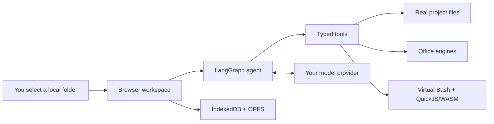

<div align="center">

# Browser Agent

### A private, browser-native project agent

Work with real local folders, run Bash, Node.js, and npm tools in a first-party browser runtime, and create Office files—without a container key, desktop agent, or whole-workspace upload.

[](https://browser-agent-wzp100-app.pages.dev/)
[](https://github.com/wzp100/browser-agent/actions/workflows/ci.yml)
[](https://www.typescriptlang.org/)
[](LICENSE)

**English** · [简体中文](README.zh-CN.md)

[Open Browser Agent](https://browser-agent-wzp100-app.pages.dev/) · [Architecture](docs/architecture/ARCHITECTURE.md) · [API configuration](docs/architecture/API-CONFIGURATION.md)

</div>

---

## What is Browser Agent?

Browser Agent is a local-first AI project workspace that runs in Chrome or Edge. You select a folder, choose a model provider, and describe a task. The agent can inspect and modify authorized files, use a browser-contained Node.js runtime, generate Office artifacts, and keep a reviewable local run history.

The application uses a BYOK model: your API key stays in the current browser session, and project files enter model context only when the agent explicitly requests them through a registered tool.

## Highlights

| | Capability | What it means |
|---|---|---|
| 🔒 | **Local-first access** | Browser File System Access API limits the app to folders you explicitly select. |
| 🧠 | **Tool-using agent** | LangGraph orchestrates model calls, typed tools, recovery, and evidence-based completion. |
| ⚡ | **Browser runtime** | Virtual Bash, persistent VFS, esbuild, and QuickJS/WASM support Node-style commands and pure-JavaScript npm packages. |
| 📄 | **Office generation** | Create and inspect spreadsheets, documents, presentations, and PDFs in the browser. |
| 🧰 | **Plugins** | Manage system, user, and project Skills plus network-authorized HTTP MCP servers from the main screen. |
| 💾 | **Durable sessions** | Projects, conversations, permissions, run records, and dependency snapshots recover locally. |
| 🌐 | **Multiple providers** | OpenAI Responses, DeepSeek Chat Completions, a local gateway, and custom OpenAI-compatible endpoints. |
| 🛡️ | **Reviewable changes** | Write authorization, file fingerprints, pre-write recovery data, diffs, logs, and run records. |

## How it works



The active execution path is:

```text
apps/web
  └─ agent-kernel
      ├─ command-core
      ├─ workspace-contracts
      ├─ runtime-virtual
      ├─ office-pack
      └─ model-adapters
```

See [ARCHITECTURE.md](docs/architecture/ARCHITECTURE.md) for the full data flow and security boundaries.

## Try the live app

Open **<https://browser-agent-wzp100-app.pages.dev/>** in a standalone Chrome or Edge window.

1. Select **New project** and grant access to a project folder.
2. Open **Settings**, choose a provider and model, and enter your API key.
3. Describe the task and review any requested write or execute action.
4. Start the Runtime when the task needs Node.js, npm, or shell-style tooling.
5. Review created files, diffs, run records, and diagnostic logs in the app.

> [!IMPORTANT]
> The runtime does not require WebContainer, a StackBlitz client key, or cross-origin isolation. It needs a modern Chrome or Edge with File System Access, WebAssembly, and Web Workers.

## Quick start

Requirements:

- Node.js 20 or newer
- Chrome or Edge with the File System Access API
- An API key for your chosen model provider

On Windows:

```powershell
Set-Location <project-directory>
.\start-dev.ps1
```

Or start it manually:

```powershell
corepack pnpm@11.7.0 install
corepack pnpm@11.7.0 --dir apps/web dev --host 127.0.0.1 --open
```

The UI follows the browser language by default and can be switched between English and Simplified Chinese in Settings.

## Model providers

| Provider | Default endpoint | Default model |
|---|---|---|
| OpenAI Responses | `https://api.openai.com/v1/responses` | `gpt-5.6` |
| DeepSeek Chat | `https://api.deepseek.com/chat/completions` | `deepseek-chat` |
| Local gateway | `http://127.0.0.1:8787` | `gpt-5.6` |
| Custom OpenAI-compatible | User-defined | User-defined |

Provider profiles and model names are stored in IndexedDB. API keys are stored only in `sessionStorage` and are removed when the browser session ends.

## Runtime boundaries

The integrated shell is a browser-native virtual Bash, not Windows PowerShell, CMD, host Bash, Docker, or a full virtual machine.

It supports common file commands, variables, conditionals, pipelines, redirections, JavaScript/TypeScript, `node`, `npm install`, and `npx`. npm archives are integrity-checked and lifecycle scripts never run automatically. esbuild bundles code for an isolated QuickJS/WASM Worker with time, memory, and stack budgets. Native binaries, native Node extensions, Python, Docker, and host executables remain out of scope.

## Privacy and security

- The app receives access only to the folder selected by the user.
- Project files are not automatically attached to model requests.
- API keys never enter project files, conversations, LocalStorage, or diagnostic logs.
- Read-only mode hides write and execute tools from the model.
- Existing-file writes use fingerprints to detect external edits before overwrite.
- Pre-write recovery data is stored locally in OPFS.
- `.git`, dependency caches, build output, and internal state are excluded from agent search and normal file synchronization.
- Diagnostic logging redacts common credential fields and does not record prompts or file contents.

No browser-only application can protect a key already exposed elsewhere. Revoke and replace any credential that appears in a chat, screenshot, log, or commit.

## Development

```powershell
# Full validation
corepack pnpm@11.7.0 verify

# Individual checks
corepack pnpm@11.7.0 typecheck
corepack pnpm@11.7.0 test
corepack pnpm@11.7.0 check:boundaries
corepack pnpm@11.7.0 build
corepack pnpm@11.7.0 test:e2e
corepack pnpm@11.7.0 verify:office
```

### Repository layout

```text
apps/
  web/                 Browser application
  gateway/             Optional local model gateway
packages/
  agent-kernel/        LangGraph orchestration and evidence gate
  command-core/        Tool registry and authorization
  workspace-contracts/ Safe access to the selected folder
  runtime-virtual      Browser-native Bash, npm, bundling, and QuickJS/WASM runtime
  office-pack/         Office tools and engines
  persistence/         IndexedDB and migration layer
skills/builtin/        Bundled reusable skills
tests/                 Unit, integration, and browser E2E tests
```

## Deployment

The included GitHub Actions workflow verifies and deploys both long-lived branches. The runtime ships entirely in the static frontend and needs no WebContainer/StackBlitz key or remote execution service.

Automatic deployment additionally requires `CLOUDFLARE_API_TOKEN` and `CLOUDFLARE_ACCOUNT_ID`:

| Branch | Purpose | Site |
|---|---|---|
| `develop` | Active development and verification | <https://develop.browser-agent-wzp100-app.pages.dev/> |
| `main` | Production releases | <https://browser-agent-wzp100-app.pages.dev/> |

Push changes to `develop` first and verify the development site. Promote the same commit to `main` only when it is ready for production; once the Cloudflare credentials are configured, pushing either branch automatically updates its mapped site.

- **Build command:** `corepack pnpm@11.7.0 build`
- **Output directory:** `apps/web/dist`
- **Required headers:** COOP `same-origin` and COEP `credentialless`

Wrangler 4 is pinned as a development dependency and configured by [`wrangler.jsonc`](wrangler.jsonc):

```bash
pnpm cloudflare:whoami
pnpm cloudflare:inspect
pnpm cloudflare:dev
pnpm cloudflare:deploy:preview
pnpm cloudflare:deploy:production
```

The deploy scripts build before uploading and map preview to `develop` and production to `main`. For CI, create a scoped Cloudflare API token with **Account / Cloudflare Pages / Edit**, save it as the GitHub Actions secret `CLOUDFLARE_API_TOKEN`, and set the account ID as the Actions variable `CLOUDFLARE_ACCOUNT_ID`. Security response headers are defined in [`apps/web/public/_headers`](apps/web/public/_headers).

## Documentation

- [Architecture](docs/architecture/ARCHITECTURE.md)
- [API configuration](docs/architecture/API-CONFIGURATION.md)
- [Architecture decisions](docs/adr/)
- [Final delivery notes](docs/architecture/FINAL-DELIVERY.md)

## License

Browser Agent source code is available under the [MIT License](LICENSE). Third-party open-source dependencies such as QuickJS and esbuild remain subject to their own licenses.
