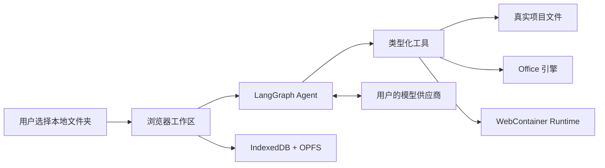

<div align="center">

# Browser Agent

### 隐私优先的浏览器原生项目智能体

直接处理本地真实文件夹，在 WebContainer 中运行 Node.js 工具，并生成 Office 文件——无需安装桌面 Agent，也不会自动上传整个工作区。

[](https://browser-agent-wzp100.pages.dev/)
[](https://github.com/wzp100/browser-agent/actions/workflows/ci.yml)
[](https://www.typescriptlang.org/)
[](LICENSE)

[English](README.md) · **简体中文**

[打开 Browser Agent](https://browser-agent-wzp100.pages.dev/) · [架构说明](docs/architecture/ARCHITECTURE.md) · [API 配置](docs/architecture/API-CONFIGURATION.md)

</div>

---

## Browser Agent 是什么？

Browser Agent 是一个在 Chrome 或 Edge 中运行的本地优先 AI 项目工作区。选择一个文件夹、配置模型，然后直接描述任务；智能体可以按权限读取和修改真实文件，使用浏览器内 Node.js Runtime，生成 Office 产物，并在本地保留可审查的运行记录。

项目采用 BYOK 模式：API Key 只保存在当前浏览器会话；只有当模型明确调用已注册工具时，对应文件内容才会进入模型上下文。

## 核心能力

| | 能力 | 说明 |
|---|---|---|
| 🔒 | **本地优先** | 通过 File System Access API，只访问用户明确选择的文件夹。 |
| 🧠 | **工具型智能体** | LangGraph 负责编排模型、类型化工具、错误恢复和完成证据。 |
| ⚡ | **浏览器 Runtime** | WebContainer 提供 `jsh`、Node.js、npm、pnpm 及兼容的纯 JavaScript 包。 |
| 📄 | **Office 生成** | 在浏览器中创建和检查表格、文档、演示文稿及 PDF。 |
| 🧰 | **Skills** | 内置或用户安装的 Skill 提供可复用工作流，并与 Agent 核心解耦。 |
| 💾 | **持久恢复** | 项目、对话、权限、运行记录和依赖快照保存在本地并可恢复。 |
| 🌐 | **多模型供应商** | 支持 OpenAI Responses、DeepSeek、本地 Gateway 和自定义 OpenAI-compatible Endpoint。 |
| 🛡️ | **可审查修改** | 支持写入授权、文件指纹、写前恢复、Diff、日志和运行记录。 |

## 工作原理



当前真实执行链路：

```text
apps/web
  └─ agent-kernel
      ├─ command-core
      ├─ workspace-contracts
      ├─ runtime-webcontainer
      ├─ office-pack
      └─ model-adapters
```

完整数据流与安全边界请参阅 [ARCHITECTURE.md](docs/architecture/ARCHITECTURE.md)。

## 在线体验

请使用独立 Chrome 或 Edge 窗口打开：

### <https://browser-agent-wzp100.pages.dev/>

1. 点击“新建任务”，选择项目文件夹并授权。
2. 打开“设置”，选择供应商和模型，填写 API Key。
3. 输入任务，并审查智能体请求的写入或执行操作。
4. 需要 Node.js、npm 或 Shell 工具时启动 Runtime。
5. 在界面中检查输出文件、Diff、运行记录和诊断日志。

> [!IMPORTANT]
> WebContainer 依赖跨源隔离。请使用独立 Chrome 或 Edge 页面，不要在应用内嵌浏览器中启动 Runtime。

## 本地启动

环境要求：

- Node.js 20 或更高版本
- 支持 File System Access API 的 Chrome 或 Edge
- 所选模型供应商的 API Key

Windows：

```powershell
Set-Location <项目目录>
.\start-dev.ps1
```

或手动运行：

```powershell
corepack pnpm@11.7.0 install
corepack pnpm@11.7.0 --dir apps/web dev --host 127.0.0.1 --open
```

界面默认跟随浏览器语言，也可以在设置中切换简体中文和英文。

## 模型供应商

| 供应商 | 默认 Endpoint | 默认模型 |
|---|---|---|
| OpenAI Responses | `https://api.openai.com/v1/responses` | `gpt-5.6` |
| DeepSeek Chat | `https://api.deepseek.com/chat/completions` | `deepseek-chat` |
| 本地 Gateway | `http://127.0.0.1:8787` | `gpt-5.6` |
| 自定义 OpenAI-compatible | 用户填写 | 用户填写 |

供应商配置和模型名保存在 IndexedDB；API Key 仅保存在 `sessionStorage`，浏览器会话结束后即清除。

## Runtime 边界

集成终端是 WebContainer `jsh`，不是 Windows PowerShell、CMD、宿主 Bash、Docker 或完整虚拟机。

它支持 Node.js 和兼容的 JavaScript 工具。原生二进制、原生 Node 扩展、Python、Docker 和宿主 EXE 不在运行边界内。源码与锁文件会和所选目录同步；依赖缓存及受限的 `node_modules` 快照保存在 `.browser-agent/packages`。

## 隐私与安全

- 应用只获得用户明确选择的文件夹权限。
- 项目文件不会自动附加到模型请求。
- API Key 不会写入项目文件、对话、LocalStorage 或诊断日志。
- 只读模式不会向模型暴露写入和执行工具。
- 覆盖已有文件前使用指纹检测外部修改，避免静默覆盖。
- 写入前的恢复数据保存在本地 OPFS。
- `.git`、依赖缓存、构建产物和内部状态不会进入 Agent 搜索及普通文件同步。
- 诊断日志会脱敏常见凭据字段，不记录提示词或文件正文。

任何已经出现在聊天、截图、日志或提交中的密钥都应立即撤销并更换。

## 开发与验证

```powershell
# 完整验证
corepack pnpm@11.7.0 verify

# 分项检查
corepack pnpm@11.7.0 typecheck
corepack pnpm@11.7.0 test
corepack pnpm@11.7.0 check:boundaries
corepack pnpm@11.7.0 build
corepack pnpm@11.7.0 test:e2e
corepack pnpm@11.7.0 verify:office
```

### 仓库结构

```text
apps/
  web/                 浏览器应用
  gateway/             可选的本地模型 Gateway
packages/
  agent-kernel/        LangGraph 编排与完成证据门
  command-core/        工具注册和执行授权
  workspace-contracts/ 真实目录安全访问
  runtime-webcontainer 浏览器内 Node.js Runtime
  office-pack/         Office 工具及引擎
  persistence/         IndexedDB 与迁移层
skills/builtin/        内置可复用 Skills
tests/                 单元、集成及浏览器 E2E 测试
```

## 部署

生产环境托管在 Cloudflare Pages，构建设置如下：

- **生产站点：** <https://browser-agent-wzp100.pages.dev/>
- **构建命令：** `corepack pnpm@11.7.0 build`
- **输出目录：** `apps/web/dist`
- **必要响应头：** COOP `same-origin`、COEP `credentialless`

响应头配置位于 [`apps/web/public/_headers`](apps/web/public/_headers)。

## 文档

- [当前架构](docs/architecture/ARCHITECTURE.md)
- [API 配置](docs/architecture/API-CONFIGURATION.md)
- [架构决策记录](docs/adr/)
- [最终交付说明](docs/architecture/FINAL-DELIVERY.md)

## 许可证

Browser Agent 源码使用 [MIT License](LICENSE)。WebContainer API 等第三方服务和依赖仍受其各自许可证及服务条款约束。
